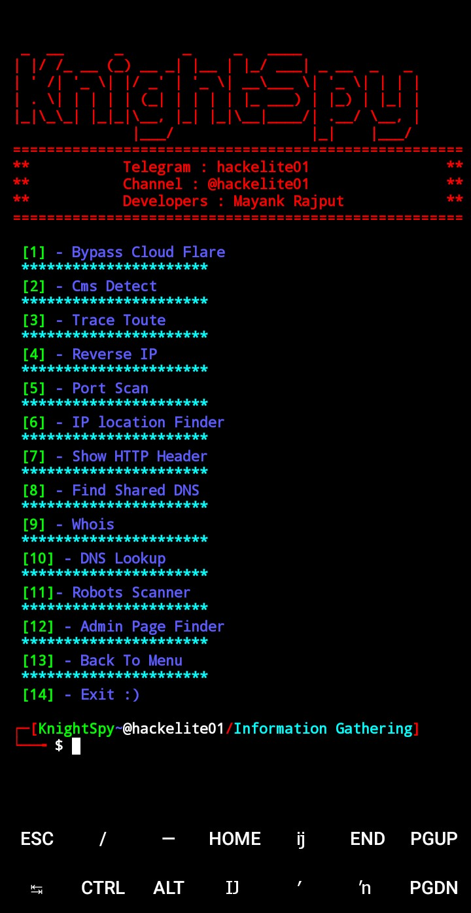

[](http://www.python.org/download/) 
<p align="center">
<a href="https://github.com/hackelite01"></a>
</p>
<p align="center">
<a href="https://t.me/hackelite01"></a>
<a href="https://t.me/hackelite01"></a>
<a href="https://t.me/hackelite01"></a>
</p>
<p align="center">
<a href="https://github.com/hackelite01"></a>
</p><br>

# KnightSpy 

KnightSpy Tool to Gather Information written in Python.


## PreView
<pre>

    
  _  __      _       _     _   ____            
 | |/ /_ __ (_) __ _| |__ | |_/ ___| _ __  _   _ 
 | ' /| '_ \| |/ _' | '_ \| __\___ \| '_ \| | | |
 | . \| | | | | (_| | | | | |_ ___) | |_) | |_| |
 |_|\_\_| |_|_|\__, |_| |_|\__|____/| .__/ \__, |
               |___/                |_|    |___/ 
 =====================================================
 **           Telegram : hackelite01                **
 **           Channel : @hackelite01                **
 **           Developers : Mayank Rajput            **
 =====================================================           
          
 [$] Choose one of the options below 

 [1] Information Gathering

 [2] CMS Detection

 [3] Developer :o

 [4] Exit . . .

 ┌─[KnightSpy~@hackelite01]
 └──╼ $ 


</pre>


## Operating Systems Tested

- Termux
- Kali Linux 2020.1
- Linux Mint 
- Windows 10,11
- Ubuntu 19.10


## Install

```bash
git clone https://github.com/hackelite01/KnightSpy.git
cd KnightSpy
pip3 install -r requirements.txt
python3 KnightSpy.py 
```

## ScreenShot



### Contact us
<td><a href="https://t.me/hackelite01"></a></td>
</tr>


 <tr>
<td><a href="mailto:hackelite.sup@gmail.com"></a></td>
